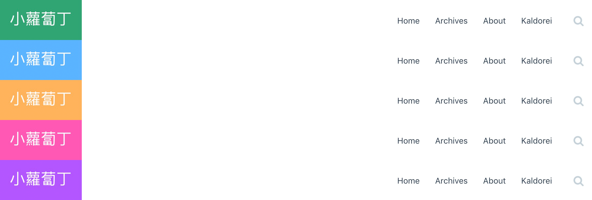
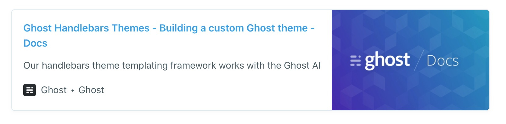

# Kaldorei

A Simple And Elegant Ghost Theme Derive From Default Theme Casper.


English | [简体中文](README_zh.md)

## Preview


## Features

- [x] Blog main theme is set to be fresh green

- [x] The post's font color is ink blue

- [x] Back To Top

- [x] Code Highlight

- [x] Side Bar

    - [x] Tag Cloud

    - [x] Table of Content
    
    - [x] Site Info
    
    - [x] Author Info
    
- [x] Post Page
    
    - [x] Author Info

- [x] Loading Posts Animation

- [x] Responsive Design

- [x] Archives

- [x] Image LightBox

- [x] Blog Global Search

- [x] Color & Fonts

- [ ] Dark mode

## Config Reference

### 🌐 Language ^2.x

Ghost2.x version supports set the language of your site, `Kaldorei` also supports Chinese/English switching, the default value is `en`.

> Configure：ghost admin > `General` > `Publication Language` Enter `zh`

### 🏷️ Tag Statistics ^2.x

In Ghost2.x version, Kaldorei uses the ghost api for statistics. so you need to enable the `Public API` function in the Ghost Labs.

> Configure：ghost admin > `Labs` > `Enable Beta Features` > `Checked Public API`

### 🌄 Lightbox ^2.x

Kaldorei integrates fancyBox 3，supports picture lightbox effect, slide show carousel, full screen preview, thumbnail preview and other fancy features. Preview & usage [Preview_Usage](http://blog.xlbd.me/how-to-use-fancybox-in-ghost-blog/)

### 💬 Disqus ^2.x

Kaldorei supports Disqus plugins，only need a short code snippet in the ghost admin `code injection`.

> Configure：ghost admin > `Code Injection` > `Blog Header`

```js
<script>
    var disqus_shortname = 'your_disqus_shortname';
</script>
```

### 🗂 Archives ^2.x

Kaldorei provides simple archives features, using ghost api to generate site archives. Preview[Blog Archives](http://blog.xlbd.me/archives)。

> Ghost 3.x Configure：ghost admin

1. Pages -> New Page -> Enter the title "Archives", At this time, the page url is `archives` by default.
2. Design > Create an archive navigation，URL：http://your_blog_url/archives;
3. Done! Go to your site find your archives page. Have fun.

> Ghost 2.x Configure：ghost admin

1. New Post > Enter the title "Archives", At this time, the page url is `archives` by default.
2. Post Settings > Checked `Turn this post into a page`，Then Publish;
3. Navigation > Create an archive navigation，URL：http://your_blog_url/archives;
4. Done! Go to your site find your archives page. Have fun.

### 🎨 Code Highlighting Theme ^2.x

Kaldorei uses [highlight.js](https://github.com/isagalaev/highlight.js) to achieve code highlight，the default theme is: `monokai-sublime`

> Configuration：ghost admin > `Code Injection` > `Blog Header`

```html
<!-- use solarized-light style -->
<link rel="stylesheet" type="text/css" href="/assets/plugins/highlight-latest/styles/solarized-light.css" />
```

[Fully Themes List](https://highlightjs.org/static/demo/)

### 🔢 Show code line number ^3.x

> New feature in Version 3.x

Kaldorei supports config the line number of code snippets，show line numbers to the left of each code blocks, it's closed by default，also support `dark` / `light` mode

> Configuration：ghost admin > `Code Injection` > `Blog Header`

```js
<script>
  var hljsSettings = {
    // Optional value: flase / true, default: false
    lineNumber: true,
    // Optional value: dark / light，default: 'dark'
    mode: 'light'
  };
</script>
```

Not only the line number can be configured, but also the background color of the line number can be customized. The default line number background color is as follows:

```html
<style>
:root {
  --linenumber-dark-bg: #282c34;
  --linenumber-light-bg: #c5d2d9;
}
</style>
```

### 🔍 Global Search ^2.x

Search engine supports search by blog title by default，This feature need the `ghost` version >= `2.10.x`。

Configure by two steps：

#### 1、Create Custom Integrations

> Configure：ghost admin > `Integrations` > `Add custom integration`


#### 2、Configure Variables

> Configure：ghost admin > `Code Injection` > `Blog Header`

```javascript
// 
<script>
  var searchSettings = {
    key: '__CONTENT__API__KEY__',  // Your custom integration Content API Key
    host: '__API__URL__',  // Your custom integration API URL
  };
</script>
```

### 🌈 Custom Color & Fonts ^2.x

Starting from `kaldorei` v2.1.0 version, users can customize the color and font of your site.



> Configure：ghost admin > `Code Injection` > `Blog Header`

```html
<style>
:root {
  --primary-color: #4af;
  --primary-light-hover: #4cf;
  --primary-dark-hover: #49f;
}
</style>
```

Fully replaceable [variables](https://github.com/xiaoluoboding/ghost-theme-kaldorei/blob/master/assets/css/variables.css)

### 🔖 Bookmark card ^3.x

Starting from `Ghost` v3.x version, It provides a new bookmark card feature, it can show the page title、excerpt、author、publisher and even a preview image. Like this:



`Kaldorei` supports bookmark card feature in the 3.x version, How to Configure, Checkout [official website](https://ghost.org/changelog/bookmark-cards/)

## Credits

* [font-awesome](https://github.com/FortAwesome/Font-Awesome)
* [bootstrap](https://github.com/twbs/bootstrap)
* [highlight.js](https://github.com/isagalaev/highlight.js)
* [velocity.js](https://github.com/julianshapiro/velocity)
* [jquery.toc.js](https://github.com/jgallen23/toc)
* [anijs](https://github.com/anijs/anijs)
* [jquery.githubRepoWidget.js](https://github.com/JoelSutherland/GitHub-jQuery-Repo-Widget)
* [fancyBox](https://github.com/fancyapps/fancyBox)
* [Ghost Search](https://github.com/HauntedThemes/ghost-search)

## License

MIT © [xiaoluoboding](https://github.com/xiaoluoboding)
